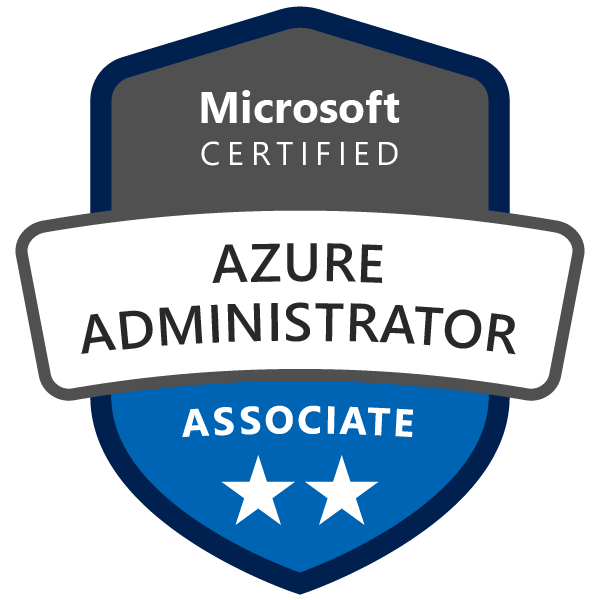
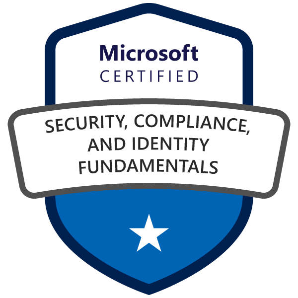
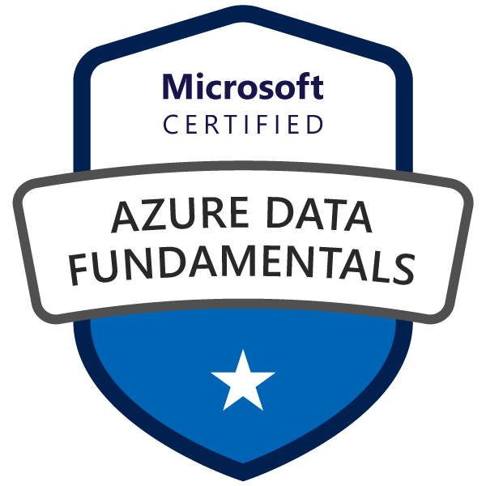
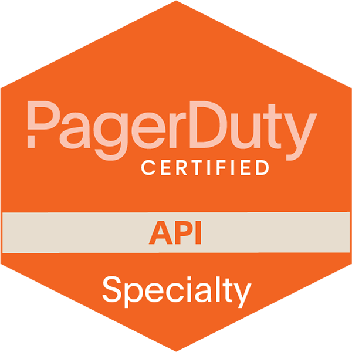

### 👋 Hi there, I'm Pranam

  
I was born and raised in <a href="https://www.mappls.com/v9fmrc" target="_blank">Mangaluru, India</a>. I have completed my Master of Science in Computer Science at <a href="https://www.mappls.com/36gd42" target="_blank"> Mangaluru Univerisity</a>.

In my previous roles, I was an architect and implemented DevSecOps, SRE, and Chaos Engineering strategies across a range of projects at different firms. Along with developing and overseeing numerous internal engineering projects, I have also established and led inner source communities within organisations and constructed APIs for R&D initiatives from conception to completion. 

In addition to actively participating in hackathons and innovation events, I also won grants and budgets for improving project features and supervised interns and junior engineers.

I'm currently pursuing a postgraduate degree in Company Secretary from [Institute of Company Secretaries of India](https://www.icsi.edu) and am committed to continuous learning and personal development, leveraging OKRs as a guiding principle to accomplish objectives.

          
#### Skills
  
| | |
|--- | --- |
| **Programming Languages** | Python, Rust |
| **Database** | CosmosDB, Redis Stack and MongoDB |
| **Event Streams** | Kafka |
| **Server Operating System** | Linux |
| **Virtualization & Cloud Native** | Docker, Podman, Helm and Kubernetes |
| **Observability & Alerting Tools** | Datadog, Grafana Stack, OpenTelemetry and PagerDuty |
| **Design Tools** | Figma |
| **DevOps Tools** | Git, GitHub, Terraform, Harness, Jira, Postman and Trivy |
| **Security** | Burp Suite, ZAP |
| **Networking** | Wireshark, TCP/IP, QUIC, UDP, CIDR, DNS, HTTP, LB |
| **Documentation** | Material for MkDocs, Confluence |

#### Education

| DEGREE      | GPA (US) | UNIVERSITY     | BATCH CYCLE |
| :---        |    :----:   |    :---: |          ---: |
| Master of Science in Computer Science      | 3.81 / 4.0      | Mangalore University   | 2016 - 2018 |
| Bachelor of Science in Computer Science   | 3.43 / 4.0        | Mangalore University      |2013 - 2016 |

> [WES](https://www.wes.org) US academic evaluation report will be shared upon request.

#### Certifications

#### Azure Cloud

#### AWS Cloud

#### Cloud Native

#### Database

#### Observability

#### Alerting

<!--
**prnam/prnam** is a ✨ _special_ ✨ repository because its `README.md` (this file) appears on your GitHub profile.

Here are some ideas to get you started:

- 🔭 I’m currently working on ...
- 🌱 I’m currently learning ...
- 👯 I’m looking to collaborate on ...
- 🤔 I’m looking for help with ...
- 💬 Ask me about ...
- 📫 How to reach me: ...
- 😄 Pronouns: ...
- ⚡ Fun fact: ...
-->
