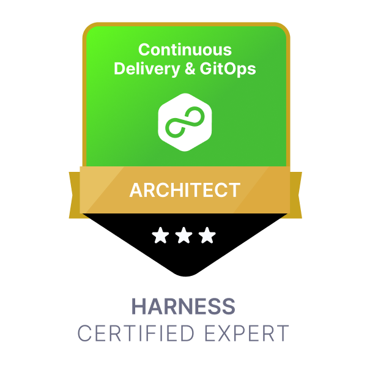
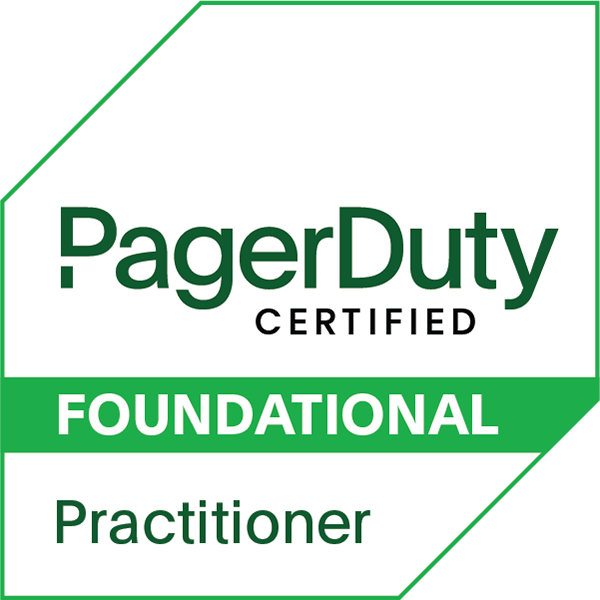

### 👋 Hi there, I'm Pranam

  
I am a mononymous person who was born and raised in <a href="https://www.mappls.com/v9fmrc" target="_blank">Mangaluru, India</a>. I have completed my Master of Science in Computer Science at <a href="https://www.mappls.com/36gd42" target="_blank"> Mangaluru Univerisity</a>.

In my previous roles, I was an architect and implemented DevSecOps, SRE, and Chaos Engineering strategies across a range of projects at different firms. Along with developing and overseeing numerous internal engineering projects, I have also established and led inner source communities within organisations and constructed APIs for R&D initiatives from conception to completion. 

In addition to actively participating in hackathons and innovation events, I also won grants and budgets for improving project features and supervised interns and junior engineers.

I'm currently pursuing a postgraduate degree in Company Secretary from [Institute of Company Secretaries of India](https://www.icsi.edu) and am committed to continuous learning and personal development, leveraging OKRs as a guiding principle to accomplish objectives.

          
#### Skills

| | |
|--- | --- |
| **Programming Languages** | Python, Rust |
| **Database** | CosmosDB, Redis Stack and MongoDB |
| **Event Streams** | Kafka |
| **Cloud** | Azure, AWS and OpenStack |
| **Server Operating System** | Linux [Distro: Ubuntu] |
| **Cloud Native** | Kubernetes and Helm |
| **Observability & Alerting Tools** | Grafana Stack and OpenTelemetry |
| **Design Tools** | Figma |
| **DevOps Tools** | Git, GitHub, OpenTofu, Harness, Jira and Postman  |
| **Security** | Burp Suite, ZAP, Falco, Trivy |
| **Networking** | Wireshark |
| **Documentation** | Material for MkDocs, Confluence |

#### Education

| DEGREE      | GPA (US) | UNIVERSITY     | BATCH CYCLE |
| :---        |    :----:   |    :---: |          ---: |
| Master of Science in Computer Science      | 3.81/4.0      | Mangalore University   | 2016 - 2018 |
| Bachelor of Science in Computer Science   | 3.43/4.0        | Mangalore University      |2013 - 2016 |

> [WES](https://www.wes.org) US academic evaluation report will be shared upon request.

#### Intellectual Property

| TRADEMARK | PATENT | DESIGN | COPYRIGHT |
| :---  |    :----:   | :---: | ---: |
| 2     | 0    | 0   | MANY |

#### Certifications

##### Azure Cloud

<!-- 

<a href ="https://learn.microsoft.com/api/credentials/share/en-in/prnam/7F68DF9DC78497F2?sharingId=6A4C6FE13ED7A5D9">
 -->
</a>

##### AWS Cloud

##### Cloud Native

##### Database

##### API

<a>

<!-- 

<a>

<a>

 -->

##### DevOps

<!-- ##### Observability

##### Alerting

##### Project Management

 -->

<!-- #### Projects

 -->

<!--
**prnam/prnam** is a ✨ _special_ ✨ repository because its `README.md` (this file) appears on your GitHub profile.

Here are some ideas to get you started:

- 🔭 I’m currently working on ...
- 🌱 I’m currently learning ...
- 👯 I’m looking to collaborate on ...
- 🤔 I’m looking for help with ...
- 💬 Ask me about ...
- 📫 How to reach me: ...
- 😄 Pronouns: ...
- ⚡ Fun fact: ...
-->
